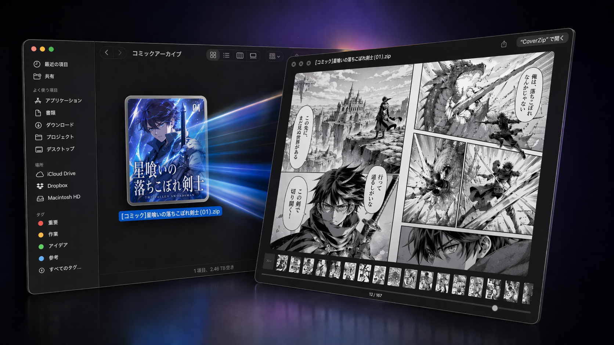
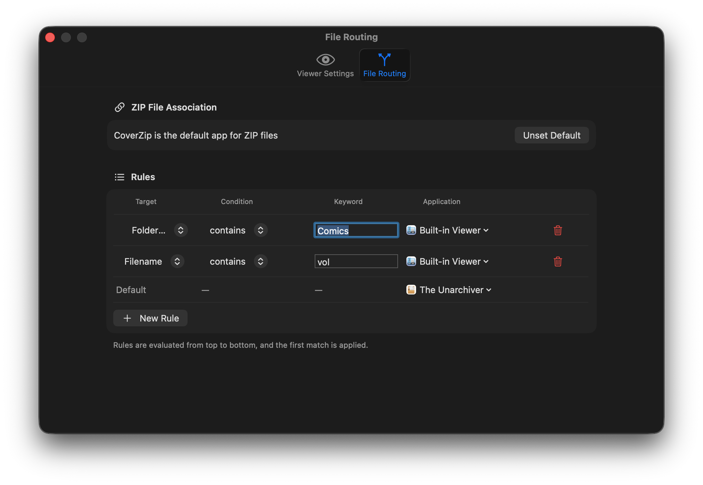

# CoverZip

**Under Development**

CoverZip is a macOS app designed for comfortably browsing comics and image collections stored in ZIP files. Once installed, comic covers appear as icons in Finder, and you can open them instantly with the spacebar.

---

## Features

### ZIP File Thumbnails (QuickLook Thumbnail)

Once CoverZip is installed, the first image inside a ZIP file is displayed as its thumbnail in Finder. You can tell which comic it is at a glance without opening the file.

If the ZIP contains a file with a cover-like name (such as `cover`, `front`, or a name starting with `00`), that image is shown preferentially.

### Read Comics with the Spacebar (QuickLook Viewer)

Select a ZIP file in Finder and press the spacebar to open CoverZip's comic viewer in QuickLook. There's no need to open the file in an app — you can flip through pages and check the contents right there.

Here's what you can do in the viewer. You can also change settings like view mode and reading direction from the right-click context menu.

- **Page navigation** is done by clicking the left or right side of the screen, or by scrolling the mouse wheel up and down. Unfortunately, **arrow keys do not work in the QuickLook viewer** (because Finder captures key events; arrow keys do work in the built-in app viewer described below).
- **View mode** can be set to "Single Page" (one page at a time) or "Spread" (two pages side by side). The "Auto" option automatically determines the layout based on image dimensions.
If the page pairing looks off in spread mode, select "**Adjust Spread Alignment**" from the menu to shift the pairing by one page.
- **Reading direction** can be switched between right-to-left (for Japanese manga) and left-to-right (for Western books).
- **Page slider** — drag it to quickly jump to any page.
- **Thumbnail strip** — displays a list of page thumbnails at the bottom; click one to jump directly to that page.
- **Slideshow** — automatically advances pages at a set interval.
- **Resume reading** — your last viewed page and display settings are remembered for each ZIP file (up to 100 recent entries).

Settings can be changed by right-clicking within the viewer or from the View menu.

### Double-Click to Open in Built-in Viewer or Another App (Routing)

If you associate CoverZip with ZIP files, double-clicking a ZIP will automatically route it to the appropriate app based on the filename.

For example, you can set it up like this:

- If a parent folder name contains "Comics", open in CoverZip's built-in viewer
- If the filename contains "vol", open in CoverZip's built-in viewer
- Otherwise, open the ZIP with an archive extraction app

When the routing target is the "Built-in Viewer", CoverZip continues running. When an external app is specified, CoverZip automatically quits after launching that app.

You can also use Option+Cmd+O (menu: `Open in Built-in Viewer...`) to open a ZIP file directly in the built-in viewer, regardless of routing settings.

### Keyboard Controls in the Built-in Viewer

In the built-in viewer, the following keyboard controls are available in addition to clicking and scrolling. Forward/backward directions for arrow keys automatically adapt to the reading direction setting (right-to-left / left-to-right).

| Key | Action |
|-----|--------|
| `←` / `→` | Move one page (in right-to-left mode, `←` goes to the next page) |
| `Space` / `Shift + Space` | Next / previous page |
| `Shift + ←` / `Shift + →`, `Page Down` / `Page Up` | Jump 10 pages |
| `Cmd + ←` / `Cmd + →`, `Home` / `End` | Go to first / last page |

You can also switch view modes and change reading direction from the `View` menu or the right-click context menu.

---

## Installation

1. Build the source code in Xcode and place CoverZip.app in your Applications folder.
2. Launch CoverZip once.
3. Open **System Settings → Privacy & Security → Extensions → QuickLook** and enable both "CoverZip Thumbnail Extension" and "CoverZip Preview Extension".

After enabling, selecting a ZIP file in Finder will show its thumbnail, and pressing the spacebar will launch the comic viewer.

---

## Configuring Routing Rules

Open Settings with Cmd+, or from the menu **CoverZip → Settings...**.

The Settings window uses a macOS sidebar layout with these tabs:
- `Viewer`: Reading direction, view mode, thumbnail visibility, page transition, and decode cache policy
- `Slideshow`: Page auto-advance interval
- `Window`: Restore preview window size/position and reset saved frame
- `File Routing`: Rule-based routing and ZIP default-app association

Rules are evaluated from top to bottom, and the first match is used.

### Match Modes

| Mode | Description | Example |
|------|-------------|---------|
| Contains | Whether the filename contains the specified string | `comic` → matches `comic01.zip` |
| Starts With | Whether the filename starts with the specified string | `vol` → matches `vol3.zip` |
| Ends With | Whether the filename ends with the specified string | `backup` → matches `data_backup.zip` |
| Wildcard | Pattern using `*` (any string) and `?` (any single character) | `vol*` → matches `vol1.zip`, `vol_special.zip` |
| Regex | Pattern matching with regular expressions | `^backup_\d+$` → matches `backup_123.zip` |

### Keyword Types

You can choose the matching target: "Filename", "Folder Name (parent folder)", or "File Extension".

### Specifying the Target App

The following formats can be used to specify an app:

- `Built-in Viewer`: Opens in CoverZip's built-in viewer
- App name (e.g., `Archive Utility`): Opens with the specified app

---

## Performance Optimizations

Here are the techniques CoverZip's viewer uses to deliver a fast reading experience.

**Instant Display, Instant Page Turns**
When opening a ZIP, the viewer first quickly retrieves the page list metadata. It then prioritizes decoding the first page ahead of all others, while the remaining pages are processed as read-ahead. The first page appears immediately after opening the file, and subsequent pages can be turned without waiting.

**Read-Ahead and Caching**
Pages adjacent to the current one are read ahead in the background, minimizing delays when turning pages. In single-page mode, 5 pages ahead and 1 page behind are prefetched; in spread mode, 3 spreads ahead and 1 behind. Up to 32 previously displayed images are kept in memory, making it fast to revisit pages.

**Smooth Page Transitions with GPU**
The next page's rendering is pre-processed on the GPU, allowing page transitions to complete instantaneously.

**Progressive Display**
When displaying a page, the viewer uses GPU pre-rendered data, high-quality cache, or low-quality cache, in that order of priority. Only when no cache is available does it asynchronously fetch a low-resolution image for interim display, then replace it with high-quality rendering later. If read-ahead has caught up, high quality is shown from the start. When flipping through pages rapidly, you may briefly see lower-quality images.

**Automatic Cache Release Under Memory Pressure**
When system memory runs low, caches are automatically released to minimize impact on other apps.

---

## Supported File Formats

CoverZip supports standard ZIP files (.zip). It recognizes common image formats inside ZIP files, including JPEG, PNG, GIF, BMP, and TIFF.

Password-protected ZIP files, Zip64 format, and compression methods other than DEFLATE are not supported.

---

## System Requirements

- macOS 14.0 (Sonoma) or later
- Supports both Intel Mac and Apple Silicon Mac

---

## Known Issues
- Arrow keys do not work in the QuickLook viewer. Finder captures key input, causing the selected file to change. Arrow keys work correctly in the built-in app viewer.
- If you select a different ZIP file in Finder while the QuickLook viewer is still open, mouse click page navigation will likely stop working. Pressing the spacebar to reopen the window will restore click navigation. Mouse wheel scrolling continues to work normally.
