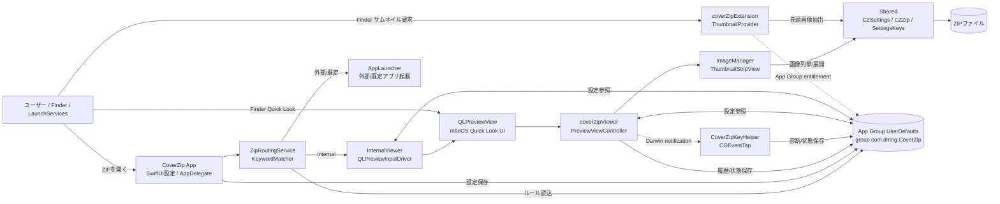
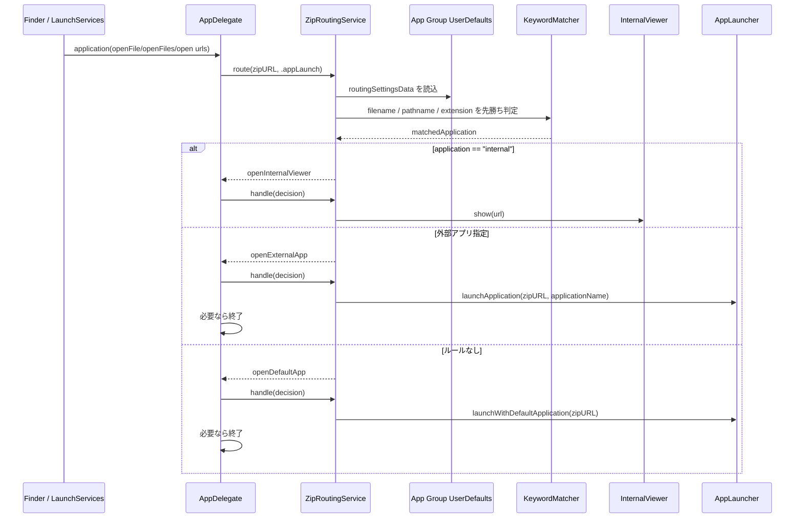
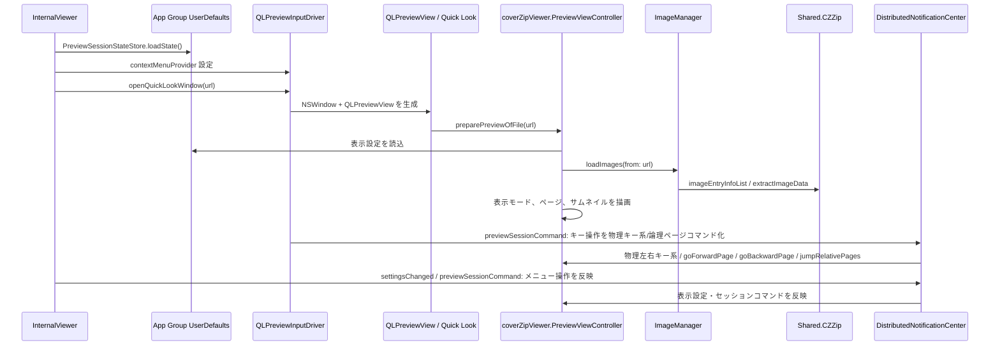
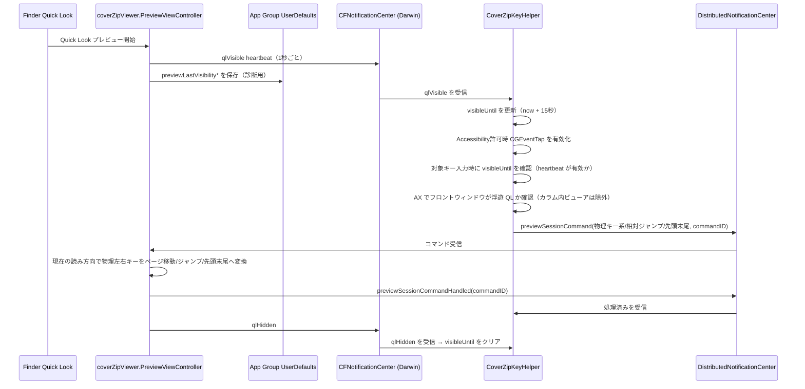
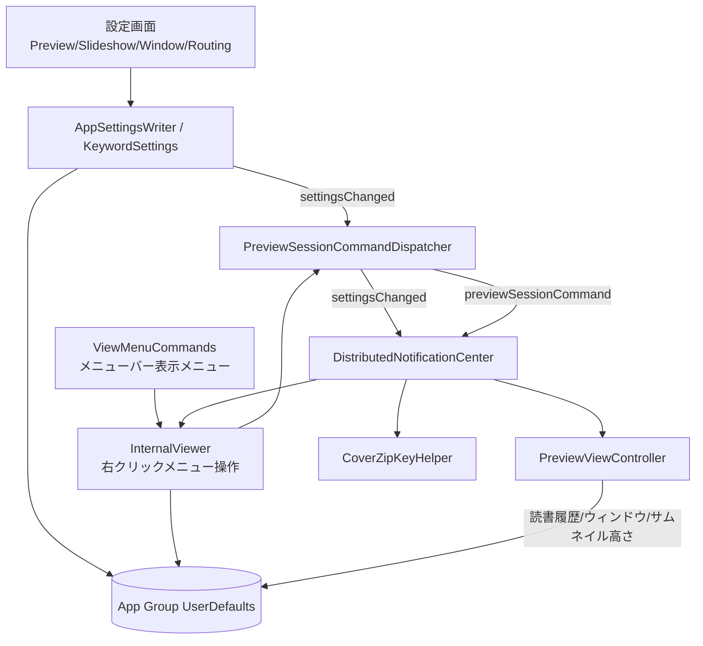
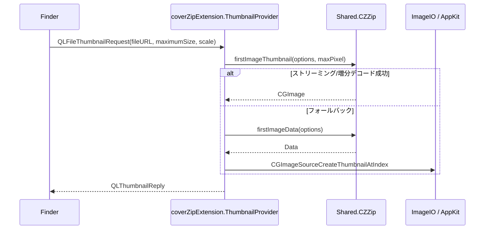

# CoverZip コンポーネント構造フロー

作成日: 2026-05-02

この資料は、CoverZip の主要コンポーネント間の関係、共有データストア、分散通知によるメッセージの流れを俯瞰するためのものです。

## 全体構成

## ZIPオープンとルーティング

ルーティング設定は `KeywordSettings` が JSON エンコードして `CZSettingsKeys.routingSettingsData` に保存します。`pathname` は ZIP の親フォルダから祖先フォルダへ順に評価され、いずれかが一致すればそのルールが採用されます。

## 内蔵ビューア経路

内蔵ビューアは独自の画像表示ロジックを持たず、`QLPreviewView` に ZIP を渡して Quick Look Preview Extension を起動します。キー入力は `QLPreviewInputDriver.KeyForwardingView` が受け、左右キーとその Shift/Cmd 派生は物理キー系の `previewSessionCommand` として Preview へ渡します。Preview は現在セッションの読み方向で前後、10ページジャンプ、先頭/末尾を決定します。

## Finder Quick Look 経路

Quick Look では App 側の `QLPreviewInputDriver` を使えないため、任意設定の `CoverZipKeyHelper` がキーイベントを中継します。Darwin 通知（`CFNotificationCenterGetDarwinNotifyCenter()`）経由で受信する heartbeat で `visibleUntil`（now + 15秒）を更新します。Darwin 通知を採用した理由は、QuickLook Extension の sandbox が `NSDistributedNotificationCenter` と App Group UserDefaults の書き込みをプロセス外に届けられないためです（Extension のホストが `QuickLookUIService` であり、CoverZip コンテナアプリのグループを継承しない）。Darwin 通知はカーネルレベルの `notify_post` を使うため sandbox 制限の対象外です。キー入力時は **heartbeat（`visibleUntil` 有効）** と **AX によるフロントウィンドウ確認** の2段階でキャプチャを判定します。AX チェックにより Finder カラム表示内の QL（フロントウィンドウが QL パネルでなくブラウザウィンドウ）は捕捉対象から除外されます。フロントアプリは Finder に限定せず、AX でフロントウィンドウが QL パネルと判定できれば捕捉します。PDF など CoverZip 以外の QL では heartbeat が届かないためキーを奪いません。左右矢印キーとその Shift/Cmd 派生では読み方向を KeyHelper 側で判断せず、物理キー系コマンドとして送ります。Preview は受信時点の `isRightToLeftReading` に基づいて前進/後退、10ページジャンプ、先頭/末尾を決定します。

## 設定同期とメニュー操作

共有設定の実体は `Shared/UnifiedAppSettings.swift` の `CZSettings` と、`Shared/UserDefaultsHelper.swift` の `CZUserDefaults.shared` です。App 側は `AppSettingsWriter`、Preview Extension 側は `coverZipViewer/Settings.swift` の `AppSettings` から同じ App Group UserDefaults を参照します。

## サムネイル生成経路

サムネイル拡張は表示設定や履歴には基本的に依存せず、Shared の ZIP 解析と画像ユーティリティを使って先頭画像からサムネイルを返します。

## データストア

| ストア | 主なキー / 内容 | 書き込み元 | 読み込み元 |
| --- | --- | --- | --- |
| App Group UserDefaults | `routingSettingsData` | 設定画面 / `KeywordSettings` | `ZipRoutingService` |
| App Group UserDefaults | `isRightToLeftReading`, `defaultViewMode`, `spreadPairOffset`, `pageTransitionEnabled`, `slideshowEnabled`, `thumbnailStripVisible` | 設定画面 / `InternalViewer` / Preview 右クリックメニュー | App / Preview Extension |
| App Group UserDefaults | `savedWindowFrameString`, `restoreWindowFrameEnabled` | `QLPreviewInputDriver` / Preview | App / Preview |
| App Group UserDefaults | `readingHistoryData` | `ReadingHistoryManager` | `ReadingHistoryManager` |
| App Group UserDefaults | `keyHelper*`, `previewLastVisibility*` | `CoverZipKeyHelper` / Preview | 設定画面の診断表示 / Preview の Shift+右クリック診断メニュー |
| ZIPファイル | 画像エントリ、圧縮データ | ユーザーのファイル | `ImageManager`, `ThumbnailProvider`, `CZZip` |
| メモリ内キャッシュ | デコード済み画像、リサイズ画像、プリレンダレイヤー | `ImageManager` | `PreviewViewController` |

## 分散通知とメッセージ

### NSDistributedNotificationCenter（プロセス間・payload あり）

| 通知名 | 送信元 | 受信元 | 用途 |
| --- | --- | --- | --- |
| `com.dmng.CoverZip.settingsChanged` | App 設定、`InternalViewer`、Preview | Preview、InternalViewer、ViewMenu | 共有設定変更の反映。読み方向変更時は userInfo に値を載せ、Preview 送信時はセッション識別用の `sessionID` も載せる |
| `com.dmng.CoverZip.previewSessionCommand` | `InternalViewer`, `QLPreviewInputDriver`, `CoverZipKeyHelper` | Preview | ページ送り、表示モード、見開き補正、スライドショーなどのセッション操作 |
| `com.dmng.CoverZip.previewSessionCommandHandled` | Preview | KeyHelper | KeyHelper が送ったコマンドの処理完了確認 |
| `com.dmng.CoverZip.sliderOperationCompleted` | Preview | `QLPreviewInputDriver` | スライダー操作後にキーボードフォーカスを戻す |
| `com.dmng.CoverZip.keyHelperQuitRequested` | App | KeyHelper | 起動中のキー入力ヘルパーへ終了を依頼 |
| `com.dmng.CoverZip.viewerWindowStateChanged` | `QLPreviewInputDriver` | `ViewMenuState` | 内蔵ビューアウィンドウの開閉状態。これはプロセス内 `NotificationCenter` |

### Darwin 通知（CFNotificationCenter Darwin・payload なし・sandbox 不問）

QuickLook Extension は `QuickLookUIService` がホストするため sandbox 制限により `NSDistributedNotificationCenter` と App Group UserDefaults のプロセス外書き込みが届きません。Extension → KeyHelper 方向の heartbeat にはカーネルレベルの Darwin 通知を使います。

| 通知名 | 送信元 | 受信元 | 用途 |
| --- | --- | --- | --- |
| `com.dmng.CoverZip.qlVisible` | Preview（1秒 heartbeat） | KeyHelper | CoverZip QuickLook が表示中であることを通知。KeyHelper は受信ごとに `visibleUntil = now + 15秒` を更新 |
| `com.dmng.CoverZip.qlHidden` | Preview（`viewWillDisappear`） | KeyHelper | QuickLook が閉じられたことを通知。KeyHelper は `visibleUntil` を即クリア |

## Quick Lookビューア受信API

ここでの「Quick Lookビューア」は `coverZipViewer/PreviewViewController.swift` を指します。受信口は Quick Look ホストから呼ばれるプレビュー準備メソッドと、`DistributedNotificationCenter` 経由のセッション通知です。

### エントリポイント

| API / 通知 | 呼び出し元 | Payload | 処理 |
| --- | --- | --- | --- |
| `preparePreviewOfFile(at url: URL) async throws` | macOS Quick Look ホスト。Finder Quick Look または App 内蔵 `QLPreviewView` | `url`: 表示対象 ZIP | 設定初期値を読み込み、`ImageManager.loadImages(from:)` で ZIP 内画像を列挙し、履歴復元、表示モード適用、サムネイルストリップ設定を行う |
| `com.dmng.CoverZip.settingsChanged` | `AppSettingsWriter`, `InternalViewer`, Preview 右クリックメニュー | 任意: `isRightToLeftReading: Bool`, `sessionID: String`。それ以外の値は App Group UserDefaults から再取得 | 読み方向、遷移、サムネイル表示、スライドショー、表示モード、見開き補正を再同期し、表示とメニュー状態を更新する |
| `com.dmng.CoverZip.previewSessionCommand` | `InternalViewer`, `QLPreviewInputDriver`, `CoverZipKeyHelper` | `command: String` が必須。任意で `boolValue`, `intValue`, `commandID` | `CZPreviewSessionCommand` として解釈し、ページ移動やセッション設定変更を即時適用する。`commandID` がある場合は処理後に `previewSessionCommandHandled` を返す |

### `previewSessionCommand` Payload

| Key | 型 | 必須 | 用途 |
| --- | --- | --- | --- |
| `command` | `String` | 必須 | `CZPreviewSessionCommand.rawValue`。後方互換として notification `object` からも読む |
| `commandID` | `String` | 任意 | KeyHelper が送信したコマンドの処理完了確認用 ID |
| `boolValue` | `Bool` | 任意 | ON/OFF 系コマンドの明示値。未指定時は現在値をトグルする |
| `intValue` | `Int` | 任意 | 見開き補正値または相対ページ移動量 |

### コマンド一覧

| Command | 呼び出し元 | Payload | Quick Lookビューア側の処理 |
| --- | --- | --- | --- |
| `setRightToLeftReading` | `InternalViewer` の右クリック/メニューバー表示メニュー | なし | 読み方向を右綴じへ変更 |
| `setLeftToRightReading` | `InternalViewer` の右クリック/メニューバー表示メニュー | なし | 読み方向を左綴じへ変更 |
| `setViewModeAuto` | `InternalViewer` の右クリック/メニューバー表示メニュー | なし | 表示モードを自動へ変更 |
| `setViewModeSingle` | `InternalViewer` の右クリック/メニューバー表示メニュー | なし | 表示モードを単ページへ変更 |
| `setViewModeSpread` | `InternalViewer` の右クリック/メニューバー表示メニュー | なし | 表示モードを見開きへ変更 |
| `setSpreadPairOffset` | `InternalViewer` の右クリック/メニューバー表示メニュー | `intValue`: `0` または `1`。未指定時は現在値を反転 | 見開きペアリング補正を変更 |
| `setThumbnailStripVisible` | `InternalViewer` の右クリック/メニューバー表示メニュー | `boolValue`: 表示状態。未指定時は現在値を反転 | サムネイルストリップの表示/非表示を変更 |
| `setPageTransitionEnabled` | `InternalViewer` の右クリック/メニューバー表示メニュー | `boolValue`: 有効状態。未指定時は現在値を反転 | ページ切替トランジションの有効/無効を変更 |
| `setSlideshowEnabled` | `InternalViewer` の右クリック/メニューバー表示メニュー | `boolValue`: 有効状態。未指定時は現在値を反転 | スライドショーを開始/停止 |
| `goToFirstPage` | `QLPreviewInputDriver`, `CoverZipKeyHelper` の Home | なし | 1ページ目へ移動 |
| `goToLastPage` | `QLPreviewInputDriver`, `CoverZipKeyHelper` の End | なし | 最終ページへ移動 |
| `goForwardPage` | `QLPreviewInputDriver`, `CoverZipKeyHelper` の上下キー | 任意: `commandID` | 読書順で次ページへ移動 |
| `goBackwardPage` | `QLPreviewInputDriver`, `CoverZipKeyHelper` の上下キー | 任意: `commandID` | 読書順で前ページへ移動 |
| `goLeftArrowPage` | `QLPreviewInputDriver`, `CoverZipKeyHelper` の左キー | 任意: `commandID` | Preview 側の現在の読み方向に基づいて次/前ページへ移動 |
| `goRightArrowPage` | `QLPreviewInputDriver`, `CoverZipKeyHelper` の右キー | 任意: `commandID` | Preview 側の現在の読み方向に基づいて次/前ページへ移動 |
| `jumpLeftArrowPages` | `QLPreviewInputDriver`, `CoverZipKeyHelper` の `Shift+←` | `intValue`: ジャンプページ数（通常 `10`） | Preview 側の現在の読み方向に基づいて相対ジャンプ方向を決め、範囲内にクランプする |
| `jumpRightArrowPages` | `QLPreviewInputDriver`, `CoverZipKeyHelper` の `Shift+→` | `intValue`: ジャンプページ数（通常 `10`） | Preview 側の現在の読み方向に基づいて相対ジャンプ方向を決め、範囲内にクランプする |
| `goToLeftArrowEdgePage` | `QLPreviewInputDriver`, `CoverZipKeyHelper` の `Cmd+←` | 任意: `commandID` | Preview 側の現在の読み方向に基づいて先頭/末尾へ移動 |
| `goToRightArrowEdgePage` | `QLPreviewInputDriver`, `CoverZipKeyHelper` の `Cmd+→` | 任意: `commandID` | Preview 側の現在の読み方向に基づいて先頭/末尾へ移動 |
| `jumpRelativePages` | `QLPreviewInputDriver`, `CoverZipKeyHelper` の PageUp/PageDown | `intValue`: 正数で前進、負数で後退 | 現在ページから相対移動し、範囲内にクランプする |

### 呼び出し元別の送信内容

| 呼び出し元 | 送信するメッセージ | 備考 |
| --- | --- | --- |
| `InternalViewer` | `settingsChanged`, `previewSessionCommand` | 右クリックメニューとメニューバー表示メニューの操作を App Group UserDefaults に保存し、同じ操作をセッションコマンドとして Preview へ送る |
| `QLPreviewInputDriver.KeyForwardingView` | `previewSessionCommand` | 内蔵ビューアウィンドウ内のキー入力をページ操作へ変換する。左右キーと Shift/Cmd 左右キーは物理キー系コマンドとして送り、Preview 側が現在の読み方向で次/前、10ページジャンプ、先頭/末尾へ変換する |
| `CoverZipKeyHelper` | `previewSessionCommand` | CoverZip Quick Look の浮遊ウィンドウが前面にある間、対象キーを捕捉し `commandID` 付きで送る。左右キーと Shift/Cmd 左右キーは物理キー系コマンドとして送り、Preview 側が現在の読み方向で次/前、10ページジャンプ、先頭/末尾へ変換する。上下キーと PageUp/PageDown は読み方向に依存しない論理コマンドを送る。Preview は処理後に `previewSessionCommandHandled` を返す |
| `AppSettingsWriter` | `settingsChanged` | 設定画面で共有設定が変わったときに送る。設定値本体は App Group UserDefaults に保存される |
| Preview 自身の右クリックメニュー | `settingsChanged` | Quick Look Extension 側で読み方向を変えたとき、グローバル設定と現在セッション読み方向を更新し、他プロセスへ通知する |
| Preview 自身の Shift+右クリックメニュー | なし | 通知は送らず、App Group UserDefaults と Bundle 情報からバージョン、ビルド番号、現在セッション読み方向、KeyHelper の診断状態をメニュー内に表示する |

## 責務境界

- `CoverZip` App は設定 UI、ZIP ルーティング、外部アプリ起動、内蔵ビューアウィンドウの生成を担当します。
- `coverZipViewer` は ZIP 内画像の表示、ページ移動、見開き、サムネイルストリップ、読書履歴を担当します。
- `coverZipExtension` は Finder サムネイル生成だけを担当します。
- `CoverZipKeyHelper` は CoverZip Quick Look（浮遊ウィンドウ）表示中のキー入力中継だけを担当し、ページ表示自体は行いません。
- `Shared` は App Group 設定キー、共有 UserDefaults、ZIP 解析、自然順ソート、画像判定、共通メニュー定義を提供します。
